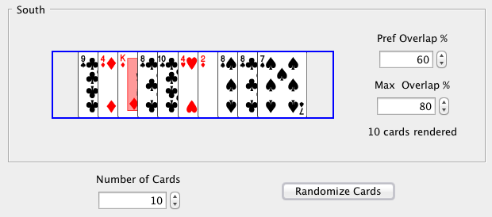

# Card Spread

In one of the games I worked on professionally ([_UNO_™](http://en.wikipedia.org/wiki/Uno_(card_game)) for _Sky TV_ set-top boxes), I had to come up with an algorithm that would spread cards in a neat way inside of a rectangle of a given length. The game had 4 players - referred to as the North, East, West, and South players - but only the cards of the South player were supposed to be drawn facing up.

The specific problem I needed to solve was how to show as many cards of a player's hands as possible without rendering any cards outside of the player's "hand rectangle" (which was different in length for the North, South, and side players). And, of course, the cards rendered for the South player needed to be identifiable at all times.

I then came up with a simple algorithm (see the algorithm's flow chart for the details) and implemented it as a java application in order to find the best values of the two parameters the algorithm requires: the _preferred overlap_ and the _maximum overlap_.

I subsequently came up with a different algorithm that also included a gap surrounding the middle card.

Originally written sometime in 2008.

## License

I'm sharing this work under the [Creative Commons Attribution-ShareAlike 4.0 International (CC BY-SA 4.0)](http://creativecommons.org/licenses/by-sa/4.0/) license. See the LICENSE file for more information.
